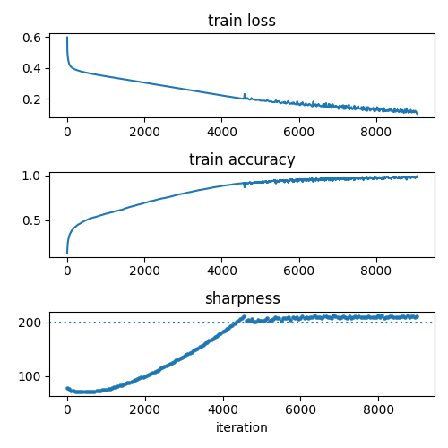
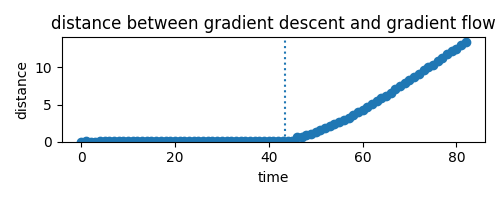

## Gradient Descent on Neural Networks Typically Occurs at the Edge of Stability

This repository contains source code for the ICLR 2021 paper [Gradient Descent on Neural Networks Typically Occurs
at the Edge of Stability](https://openreview.net/forum?id=jh-rTtvkGeM) by Jeremy Cohen, Simran Kaur, Yuanzhi Li, Zico Kolter, and Ameet Talwalkar.


The structure of this README is:
1. [Preliminaries](#anchors-in-markdown)
2. [Quick start](#quick-start)
3. [Complete documentation](#complete-documentation)

### Preliminaries

To run the code, you need to set two environment variables:
1. Set the `DATASETS` environment variable to a directory where datasets will be stored.
 For example: `export DATASET="/my/directory/datasets"`.
2. Set the `RESULTS` environment variable to a directory where results will be stored.
 For example: `export RESULTS="/my/directory/results"`.

### Quick start

Let's walk through how to use `gd.py` and `flow.py`.

#### Gradient descent

The script `gd.py` trains a neural network using gradient descent.
For example:
```
python src/gd.py --dataset cifar10-5k --arch_id fc-tanh --loss mse --opt gd --lr 0.01  --max_steps 100000 --acc_goal 0.99 --neigs 2  --eig_freq 100
```
The above command will train a fully-connected tanh network (`fc-tanh`) on a 5k subset of CIFAR-10 (`cifar10-5k`) using the square loss (`mse`).
We will run vanila gradient descent (`gd`) with step size 0.01 (`lr`).
Training will terminate when either the train accuracy reaches 99% (`train_acc`) or when 100,000 (`max_steps`)
iterations have passed.
Every 50 (`eig_freq`) iterations, the top 2 (`neigs`) eigenvalues of the training loss Hessian will be computed and recorded.
The training results will be saved in the following output directory:
```
${RESULTS}/cifar10-5k/fc-tanh/seed_0/mse/gd/lr_0.01
```
(See `get_gd_directory()` in `utilities.py` for the formula by which this output directory is named.)

Within this output directory, the following files will be created, each containing a PyTorch tensor:
 - `train_loss_final`, `test_loss_final`, `train_acc_final`, `test_acc_final`: the train and test
 losses and accuracies, recorded at each iteration
 - `eigs_final`: the top 2 eigenvalues, measured every 50 (`eig_freq`) iterations.

The following matplotlib code will plot the train loss, train accuracy, and sharpness.
```python
import torch
import matplotlib.pyplot as plt

RESULTS = ... # results directory 

dataset = "cifar10-5k"
arch = "fc-tanh"
loss = "mse"
gd_lr = 0.01
gd_eig_freq = 50


gd_directory = f"{RESULTS}/{dataset}/{arch}/seed_0/{loss}/gd/lr_{gd_lr}"

gd_train_loss = torch.load(f"{gd_directory}/train_loss_final")
gd_train_acc = torch.load(f"{gd_directory}/train_acc_final")
gd_sharpness = torch.load(f"{gd_directory}/eigs_final")[:,0]

plt.figure(figsize=(5, 5), dpi=100)

plt.subplot(3, 1, 1)
plt.plot(gd_train_loss)
plt.title("train loss")

plt.subplot(3, 1, 2)
plt.plot(gd_train_acc)
plt.title("train accuracy")

plt.subplot(3, 1, 3)
plt.scatter(torch.arange(len(gd_sharpness)) * gd_eig_freq, gd_sharpness, s=5)
plt.axhline(2. / gd_lr, linestyle='dotted')
plt.title("sharpness")
plt.xlabel("iteration")
```



#### Gradient flow

The following command will train the same network using gradient flow --- that is, by using the Runge-Kutta
 algorithm to numerically integrate the gradient flow ODE.
```
python src/flow.py --dataset cifar10-5k --arch_id fc-tanh --loss mse  --tick 1.0  --max_time 1000 --acc_goal 0.99 --neigs 2  --eig_freq 1
```
Here, the flag ``--tick 1.0`` means that the train/test losses and accuracies will be computed and saved after each 1.0 units of time, 
and the flag `--max_time 1000` means that training will stop after a maximum of 1000 units of time (or until the train accuracy reaches the `acc_goal` of 0.99).
The other flags mean the same thing as in the `gd.py` example above.

See the detailed `flow.py` documentation below for details on how the Runge Kutta step size is set.

The following matplotlib code will plot the train loss, train accuracy, and sharpness:

```python
flow_tick = 1.0
flow_eig_freq = 1

flow_directory = f"{RESULTS}/{dataset}/{arch}/seed_0/{loss}/flow/tick_{flow_tick}"

flow_train_loss = torch.load(f"{flow_directory}/train_loss_final")
flow_train_acc = torch.load(f"{flow_directory}/train_acc_final")
flow_sharpness = torch.load(f"{flow_directory}/eigs_final")[:, 0]

plt.figure(figsize=(5, 5), dpi=100)

plt.subplot(3, 1, 1)
plt.plot(torch.arange(len(flow_train_loss)) * flow_tick, flow_train_loss)
plt.title("train loss")

plt.subplot(3, 1, 2)
plt.plot(torch.arange(len(flow_train_acc)) * flow_tick, flow_train_acc)
plt.title("train accuracy")

plt.subplot(3, 1, 3)
plt.scatter(torch.arange(len(flow_sharpness)) * flow_tick * flow_eig_freq, flow_sharpness, s=5)
plt.title("sharpness")
plt.xlabel("time")
```


 
 
#### Comparing gradient descent to gradient flow

Now suppose that we'd like to track the discrepancy between the gradient descent trajectory and
the gradient flow trajectory.
That is, to the extent that gradient descent is a discretization of the gradient flow ODE,
we might expect N steps of gradient descent at step size 0.01 to reach the same place as 
gradient flow after "0.01 N" units of time. 

By adding the flags `--nproj 500 --iterate_freq 100` to the `src/gd.py` command above, we can 
instruct `gd.py` to save a 500-dimensional random projection of the iterates (the network weights) every 100 iterations.
Since the learning rate was 0.01, this amounts to saving a random projection of the iterates every 1.0 units of time.
A PyTorch tensor containing the random projections of the iterates will be stored in the output directory, under the filename `iterates_final`.

Similarly, by adding the flags `--nproj 500 --iterate_freq 1` to the `src/flow.py` command, we can
instruct `flow.py` to save a 500-dimensional random projection of the iterates every 1 tick (which, in turn, means every 1 unit of time, since `tick`= 1 ).
 
Thus, for both gradient descent and gradient flow, we're saving (random projections of) the iterates every 1.0 units of time.
Therefore, we can directly compare these saved iterates in order to assess whether gradient descent follows the same
trajectory as gradient flow.
 
 The following matplotlib code plots the distance between the gradient descent trajectory and the gradient flow trajectory: 

```python
gd_iterate_freq = 50
flow_iterate_freq = 1

# the GD iterates are saved every "gd_lr * gd_iterate_freq" units of time.
# the GF iterates are saved every "flow_tick * flow_iterate_freq" units of time.
# to directly compare the trajectories, these two quantities should be equal.
assert gd_lr * gd_iterate_freq == flow_tick * flow_iterate_freq

gd_iterates = torch.load(f"{gd_directory}/iterates_final")
flow_iterates = torch.load(f"{flow_directory}/iterates_final")
length = min(len(gd_iterates), len(flow_iterates))

times = torch.arange(length) * flow_tick * flow_iterate_freq
distance = (gd_iterates[:length, :] - flow_iterates[:length, :]).norm(dim=1)

# the time at which the gradient descent sharpness first crosses the threshold (2  / gd_lr)
cross_threshold_time = (gd_sharpness > (2 / gd_lr)).nonzero()[0][0] * gd_lr * gd_iterate_freq

plt.figure(figsize=(5, 2), dpi=100)
plt.scatter(times, distance)
plt.axvline(cross_threshold_time, linestyle='dotted')
plt.ylim((0, plt.ylim()[1]))
plt.title("distance betwen gradient descent and gradient flow")
plt.xlabel("time")
plt.ylabel("distance")

```


The dotted vertical line marks the iteration when the gradient descent sharpness crosses the gradient descent stability threshold 2 / 0.01.
We can see that the gradient descent trajectory approximately tracks the gradient flow
 trajectory before this time, but departs immediately afterwards.


## Complete documentation

#### Gradient descent

The script `src/gd.py`trains a network using full-batch gradient descent.

The required parameters of `src/gd.py` are:

- `dataset` [string]: the dataset to train on. The possible values are:
    - `cifar10`: the full CIFAR-10 dataset
    - `cifar10-5k`: the first 5,000 examples from the full CIFAR-10 dataset.  Along similar lines, you can also enter `cifar10-1k`, `cifar10-2k`, `cifar10-10k`, and `cifar10-20k`.
    - we will soon add the other datasets from the paper (wikitext, the synthetic datasets) to this repo  
- `arch_id` [string]: which network architectures to train.  See `load_architecture()` in `archs.py` for a full list of the permissible values.
- `loss` [string]: which loss function to use.  The possible values are:
    - `ce`: cross-entropy loss
    - `mse`: mean squared error (square loss).  When the network has a scalar-valued output (e.g. in regression tasks), this is
    defined as 0.5 times the squared difference between the network output and the target scalar.
    More generally, when the network has a vector-valued output (e.g. in multiclass classification), this is defined
     as 0.5 times the squared L2 norm between the network outputs and the target vector.
     For classification tasks, we construct the target vector by assigning a 1 at the location of
     the true class, and assigning 0's everywhere else.
- `opt` [string]: which (full-batch) gradient descent variant to use.  The options are:
    - `gd`: vanilla gradient descent.
    - `polyak`: Polyak-style momentum.
     If you use this option, make sure to pass in a value for `beta` (the momentum parameter). 
    - `nesterov`: Nesterov-style momentum.
    If you use this option, make sure to pass in a value for `beta` (the momentum parameter).
 - `lr` [float]: the learning rate
 - `max_steps`: the maximum number of gradient descent steps to train for.

The optional parameters of `src/gd.py` are:
 - `seed` [int]: the random seed used when initializing the network weights.
 - `beta` [float]: if you use Polyak or Nesterov momentum (i.e. if `gd` = `polyak` or `nesterov`), this is the value of the momentum
 parameter.  This parameter is ignored if you run vanilla gradient descent.
 - `physical_batch_size` [int, defaults to 1000]: the maximum number of examples that we try to fit on the GPU at once.
 For large networks, you may have to reduce this from the default of 1000.
 Note that for non-BN networks, changing this value will have no impact on the result of the training process.
 On the other hand, for BN networks, this value determines the "ghost batch size."
 - `acc_goal` [float between 0 and 1]: if this parameter is set, we terminate training if the train accuracy ever reaches above `acc_goal`.
 - `loss_goal` [float]: if this parameter is set, we terminate training if the train loss ever reaches below `loss_goal`.
 - `neigs` [int, defaults to 0]: the number of top eigenvalues to compute.
 - `eig_freq` [int, defaults to -1]: the frequency at which we compute the top `neigs` Hessian eigenvalues.
For example, if `eig_freq` is 10, we compute the leading Hessian eigenvalues every 10 GD iterations.
If `eig_freq` is set to `-1` (the default value), we never compute the top Hessian eigenvalues.
- `nproj`: [int, defaults to 0]: the number of random projections to use when we save random projections of the iterates.
- `iterate_freq` [int, defaults to -1]: the frequency at which we save random projections of the iterates.
For example, if `iterate_freq` is 10, we save random projections of the iterates every 10 GD iterations.
If `iterate_freq` is set to -1 (the default value), we never save random projections of the iterates.
- `abridged_size` [int, defaults to 5000]: when computing the top Hessian eigenvalues, use an "abridged" dataset of this
size (obtained by choosing the first `abridged_size` examples in the training dataset.).
- `save_model` [bool, defaults to False]: if `true`, save the model weights at the end of training.

#### Gradient flow

The script `src/flow.py` trains a network using gradient flow, i.e. by using the Runge-Kutta 
algorithm to numerically integrate the gradient flow ODE.

 
The Runge-Kutta algorithm requires a step size parameter.
Similar to gradient descent, for Runge-Kutta to be stable 
this step size must be small in regions where the sharpness is high.
We therefore set the step size using the heuristic
```
runge kutta step size = min(alpha / [estimated sharpness], max_step_size) 
```
where ``--alpha`` and `--max_step_size` are flags that can be passed to `src/flow.py`, 
and `[estimated sharpness]` is the most recent cached value of the sharpness.
Runge-Kutta is stable when its step size is less than c / sharpness, where c is a 
particular constant between 2 and 3. 
Therefore, `alpha` is set by default to be 1.0, though a value as high as 2.0 should
also be fine in most cases.
The `max_step_size` parameter is intended to be an additional stopgap
to account for the fact that the sharpness may increase rapidly, causing the true sharpness to 
be a lot higher than the most recently cached sharpness.

The required parameters of `src/flow.py` are:

- `dataset` [string]: see above
- `arch_id` [string]: see above
- `loss` [string]: see above
- `tick` [float]: the train / test losses and accuracies will be computed and saved every `tick` units of time.
 - `max_time` [float]: the maximum time (ODE time, not wall clock time) to run gradient flow for.

The optional parameters of `src/flow.py` are:
 - `alpha` [float, defaults to 1.0]: the Runge-Kutta step size is `min(alpha / [estimated sharpness], max_step_size)`
 - `max_step_size` [float, default to 999]: the Runge-Kutta step size is `min(alpha / [estimated sharpness], max_step_size)`
 - `seed` [int]: see above
 - `physical_batch_size` [int, defaults to 1000]: see above
 - `acc_goal` [float between 0 and 1]: see above
 - `loss_goal` [float]: see above
 - `neigs` [int, defaults to 0]: see above
 - `eig_freq` [int, defaults to -1]: see above
 - `nproj`: [int, defaults to 0]: see above
- `iterate_freq` [int, defaults to -1]: see above
- `abridged_size` [int, defaults to 5000]: see above
- `save_model` [bool, defaults to False]: see above

